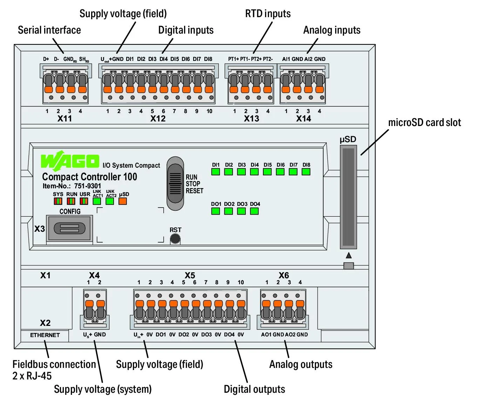
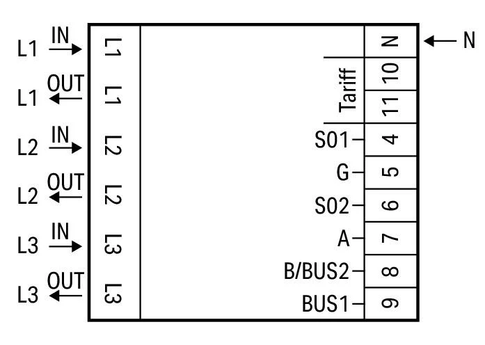
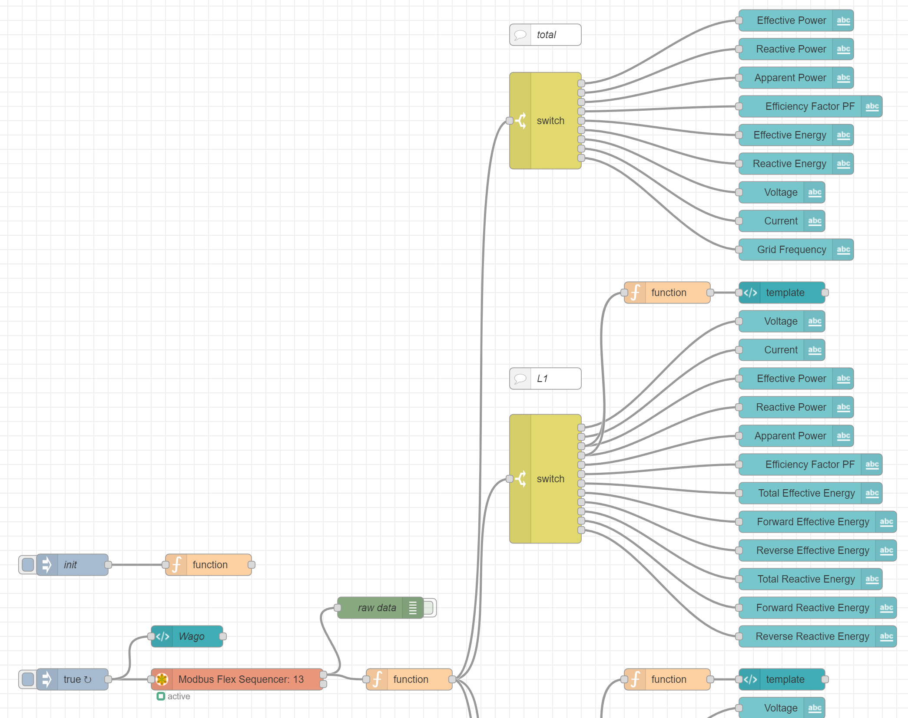
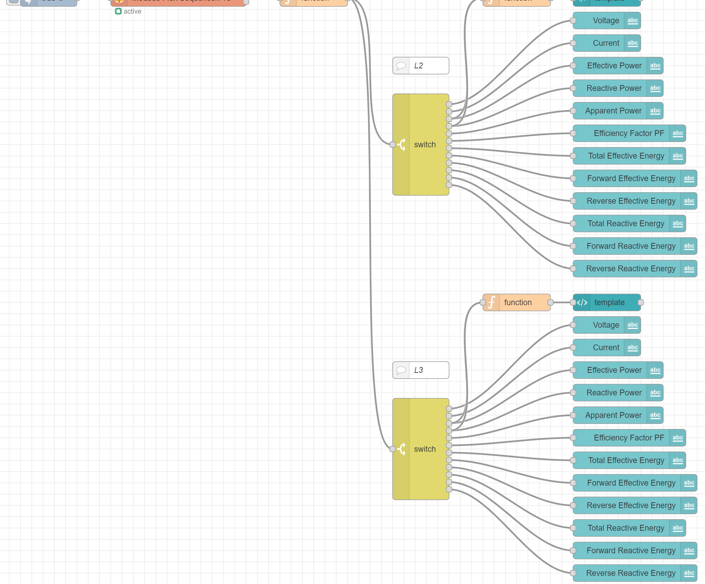
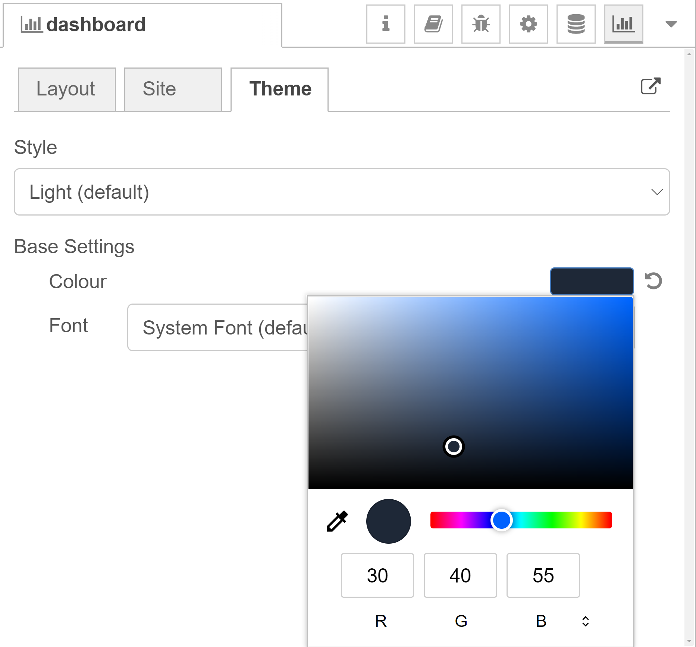

# cc100-mid-dashboard
This repo describes how to set up a sample dashboard for the MID from WAGO in Node-RED. For this, the MID must to be connected to a CC100.

# How to import the MID Dashboard in Node-RED

## Prerequisites for tutorial
* WAGO CC100 (751-9301) 
    - install docker and move docker "DATA-ROOT" to an inserted SD card
    - see [cc100-tutorial](https://www.youtube.com/watch?v=ZIcp3H0h6q0) for help
    - [docker-ipk](https://github.com/WAGO/docker-ipk)
* WAGO Energy Meter (MID) (e.g. 879-3000)
* for firmware download or update see [cc100-firmware](https://github.com/WAGO/cc100-firmware)
* PC with preinstalled SSH Client (e.g. [PuTTY](https://www.putty.org/))
* Web browser of your choice. (e.g. chrome)

## Setup
1. Connect the MID to your CC100 via Modbus. The order is irrelevant.
2. In case of MID 879-3000 connect **A (7)** with **D+ (X11.1)** of the CC100 and **B (8)** with **D- (X11.2)** of the CC100

## CC100 Login
Start SSH Client e.g. Putty 
<pre><code>login as 'root'
password 'wago'
</code></pre>

## Check docker installation
<pre><code>docker info
docker ps           # to see all running containers (no container should run)
docker images       # to see all preinstalled images
</code></pre>

Enjoy the power of the whale!

## Import Dashboard in Node-RED
1. Use the following command to start a Node-RED container

<pre><code>docker run -d \
--name node-red \
--restart always \
--privileged=true \
--user=root \
-p 1880:1880 \
-v node_red_user_data:/data \
-v /dev/ttySTM1:/dev/serial \
nodered/node-red
</code></pre>

2. Enter **\<ip of your PFC>\:1880** in your web browser to open Node-RED
3. Open to the **burger-menu** and navigate to **Manage palette** - **Install**
4. Install the **node-red-contrib-modbus** lib and the **node-red-dashboard** lib
5. Open the **burger-menu** again and click **Import**
6. Select the file [midDashboard.json](midDashboard.json) (download first)

7. Navigate to **dashboard** - **Theme** and change the color theme

8. Deploy
9. Click the **init**-Node
10. Enter **\<ip of your PFC>\:1880/ui** in your web browser to open the MID dashboard

## Further CC100 Projects
See [CC100 video tutorials](https://www.youtube.com/channel/UCV2GhmZPWc5JU73ktI1St4Q/videos) to learn about the cc100 lib in Node-RED

## Links
1. [https://www.wago.com/de/](https://www.wago.com/de/)
2. [https://github.com/docker/docker-ce](https://github.com/docker/docker-ce)