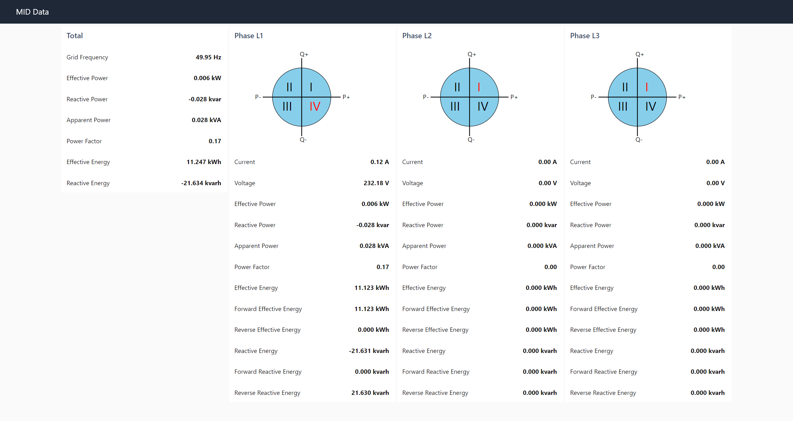

# cc100-mid-dashboard
This repository shows the implementation of an energy dashboard on the WAGO CC100 using Node-RED. The WAGO energy meter (MID) is used as source for the energy data.

## Prerequisites for tutorial
* WAGO CC100 (751-9301) 
    - install docker and move docker "DATA-ROOT" to an inserted SD card
    - see [cc100-tutorial](https://www.youtube.com/watch?v=ZIcp3H0h6q0) for help
    - [docker-ipk](https://github.com/WAGO/docker-ipk)
* WAGO Energy Meter (MID) (e.g. 879-3000)
* for firmware download or update see [cc100-firmware](https://github.com/WAGO/cc100-firmware)
* PC with preinstalled SSH Client (e.g. [PuTTY](https://www.putty.org/))
* Web browser of your choice. (e.g. chrome)

> Follow the [cc100-serial-communication repository](https://github.com/WAGO/cc100-serial-communication) for better understanding

## Setup
The idea is to use the CC100 to read energy data from the MID via Modbus RTU and display it on a Node-RED dashboard.

Connect the terminals X11.1 and X11.2 of the CC100 with the terminals 7 and 8 of the MID

## CC100 Login
Start SSH Client e.g. Putty 
<pre><code>login as 'root'
password 'wago'
</code></pre>

## Check docker installation
<pre><code>docker info
docker ps           # lists all running containers (no container should run)
docker images       # lists all preinstalled images
</code></pre>

## Start Node-RED container
<pre><code>docker run -d \
--name node-red \
--restart always \
--privileged=true \
--user=root \
-p 1880:1880 \
-v node_red_user_data:/data \
-v /dev/ttySTM1:/dev/serial \
wagoautomation/node-red-cc100:1.0.0
</code></pre>

## Import Node-RED dashboard
1. Open Node-RED by typing **\<ip of your PFC>\:1880** into your browser
2. Install the **node-red-dashboard** lib (burger menu - Manage palette - Install)
3. Import the flow [MID Dashboard](flow_mid_dashboard.json)

4. Deploy the flow
5. Click on the injection node to read the MID data
6. Open the dashboard by typing **\<ip of your PFC>\:1880/ui** into your browser

> You can adapt the flow to your needs by reading other registers as well. The addresses of all registers that can be read can be found in the data sheet of the MID. Please note that the addresses for the Modbus read nodes must be specified as decimal values.

## Further CC100 Projects
* [CC100 video tutorials](https://www.youtube.com/channel/UCV2GhmZPWc5JU73ktI1St4Q/videos)
* [cc100-serial-communication](https://github.com/WAGO/cc100-serial-communication)
* [cc100-energy-dashboard](https://github.com/WAGO/cc100-energy-dashboard)

## Sources
* [WAGO CC100 data sheet](https://www.wago.com/global/plcs-%E2%80%93-controllers/compact-controller-100/p/751-9301)
* [WAGO Energy Meter (MID) information](https://www.wago.com/global/interface-electronic/discover-current-transformers-voltage-taps/mid-energy-meters)
* [MID data sheet](https://www.wago.com/global/current-transformers-and-voltage-taps/energy-meter-mid/p/879-3000)
